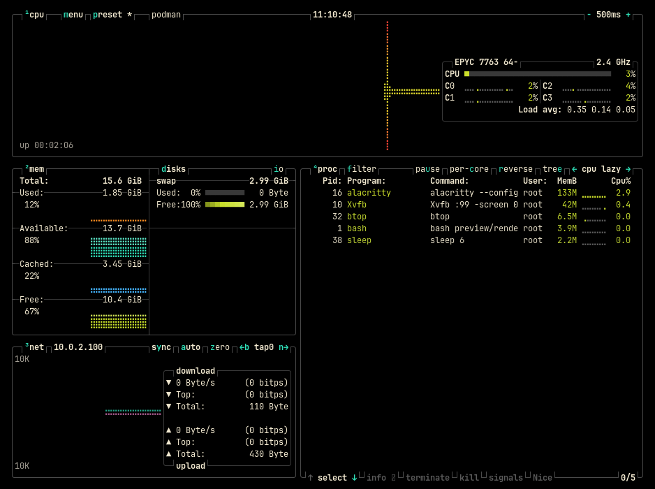
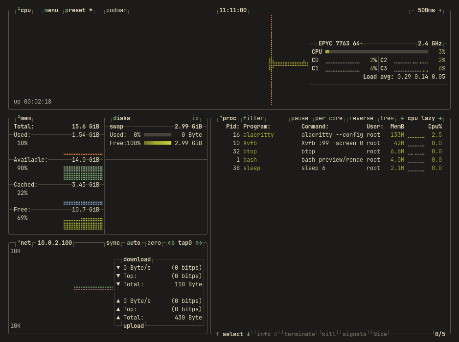

# Acid for btop

Two flavours: **Acetic** (`#000000`), vibrant, and **Citric** (`#1c1b19`), muted.

Part of [Acid](https://github.com/acid-theme/acid), a very dark colourscheme in two
flavours. The main README lists the other ports.

## Preview

| Acetic | Citric |
| --- | --- |
|  |  |

## Install

```sh
mkdir -p ~/.config/btop/themes
curl -fsSLo ~/.config/btop/themes/acid-acetic.theme \
  https://raw.githubusercontent.com/acid-theme/btop/main/acid-acetic.theme
```

Then select it in `~/.config/btop/btop.conf`:

```conf
color_theme = "acid-acetic"
theme_background = true
```

`theme_background = false` keeps the terminal's own background instead of the
theme's `main_bg`, which is what to use with a transparent terminal.

btop accepts a theme without validating it: a malformed colour, an unknown key
and a missing themes directory all pass silently, so a typo shows up as a
default colour rather than an error.

## Files

- `acid-acetic.theme`
- `acid-citric.theme`

## Generated

Acid 0.1.0, rendered by acidify from
[`ports/btop/acid.theme.tera`](https://github.com/acid-theme/acid/blob/main/ports/btop/acid.theme.tera).
Edits to these files are overwritten on the next release. Report issues on
[acid-theme/acid](https://github.com/acid-theme/acid/issues).

## Licence

MIT.
