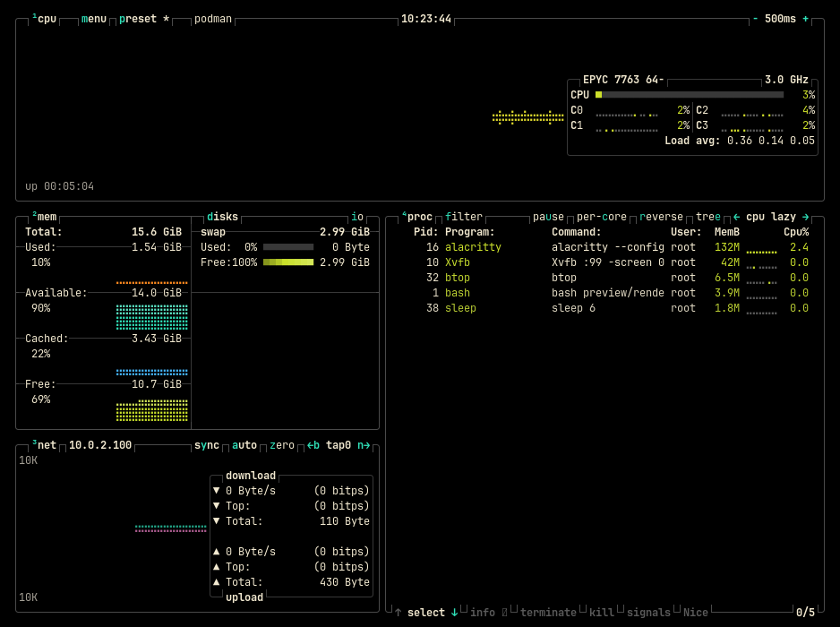
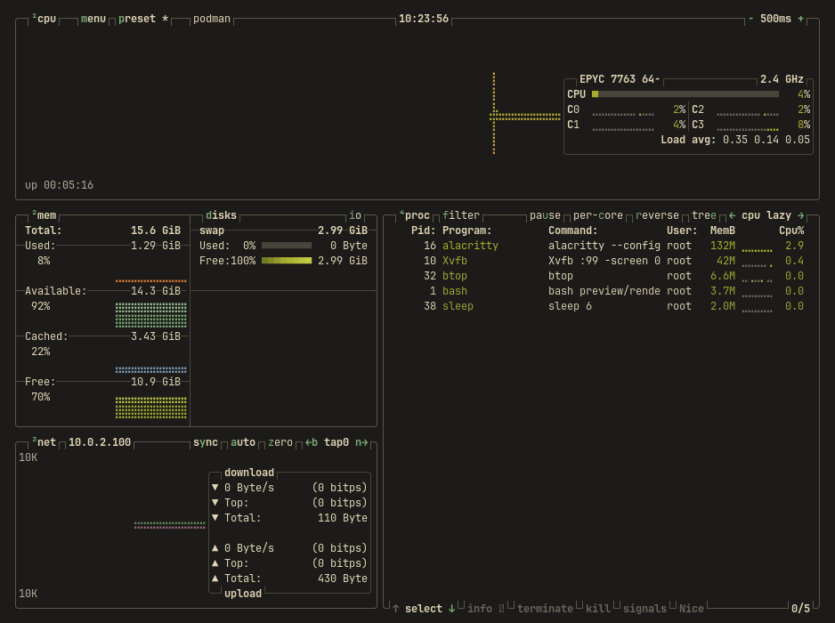
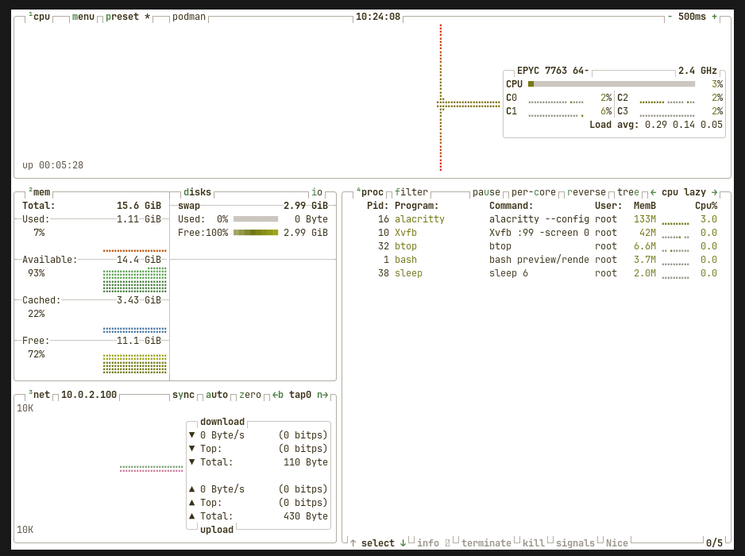

# Acid for btop

Generated from [acid-theme/acid](https://github.com/acid-theme/acid) — open issues
and pull requests there.

<details>
<summary>Screenshots</summary>

| Acetic | Citric | Lactic |
| --- | --- | --- |
|  |  |  |

</details>

## Install

```sh
mkdir -p ~/.config/btop/themes
curl -fsSLo ~/.config/btop/themes/acid-acetic.theme \
  https://raw.githubusercontent.com/acid-theme/btop/main/acid-acetic.theme
```

Then select it in `~/.config/btop/btop.conf`:

```conf
color_theme = "acid-acetic"
theme_background = true
```

`theme_background = false` keeps the terminal's own background instead of the
theme's `main_bg`, which is what to use with a transparent terminal.

## Credits

[@ssiyad](https://github.com/ssiyad)
